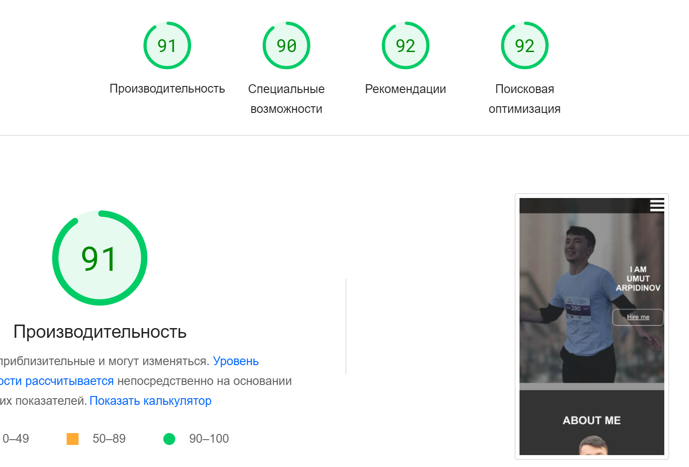
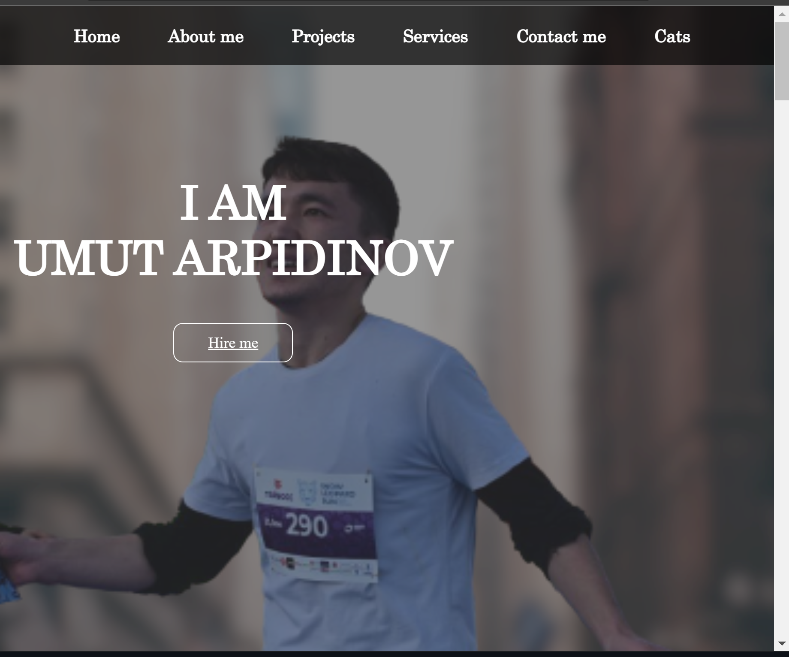
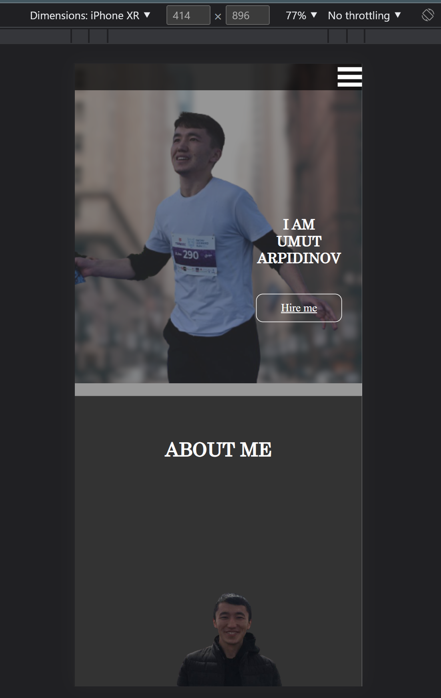
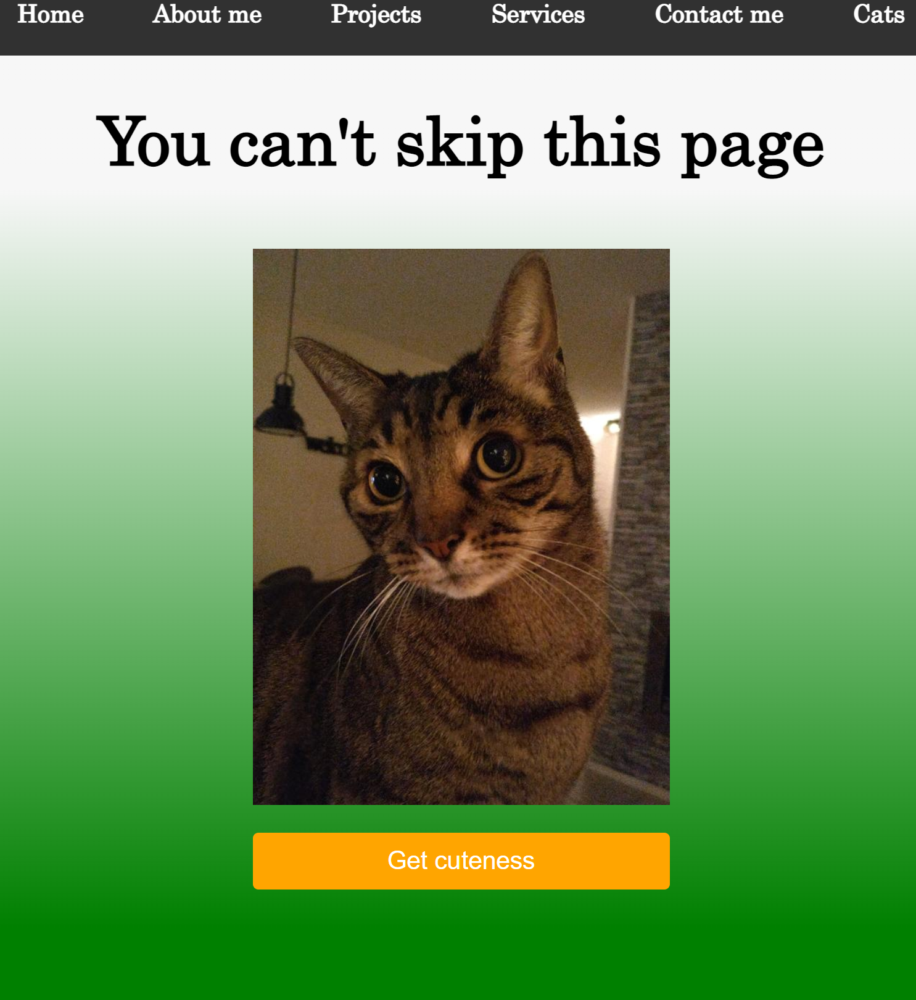

# My personal website
> This is my first project in WEB  that I wrote with understanding what is happening in shell

# Screenshots

## Page speed

## Responsiven design

## Responsiven design

## Fetch API

## Project Status
Project is: _in progress_ 

## Contact
Created by [github.com](https://github.com/Umut-Arpidinov)) - feel free to contact me!

